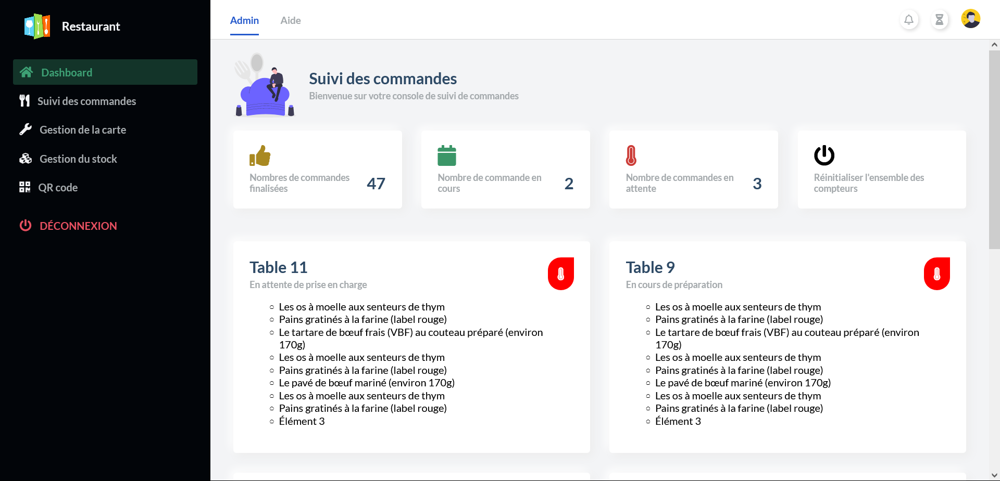
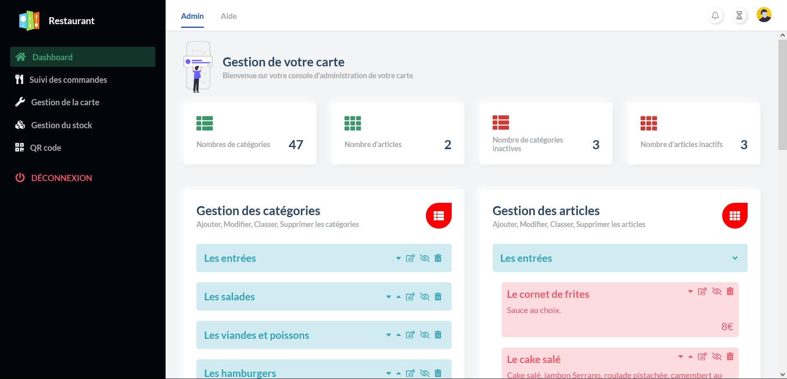
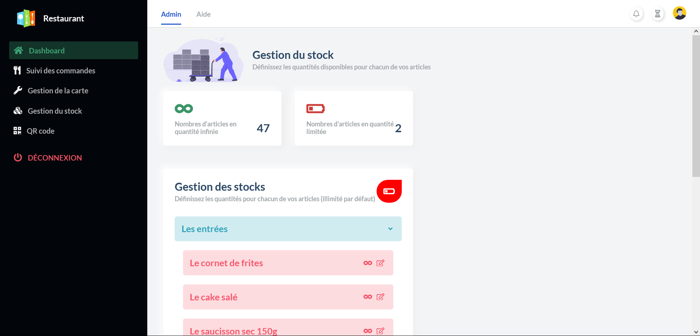
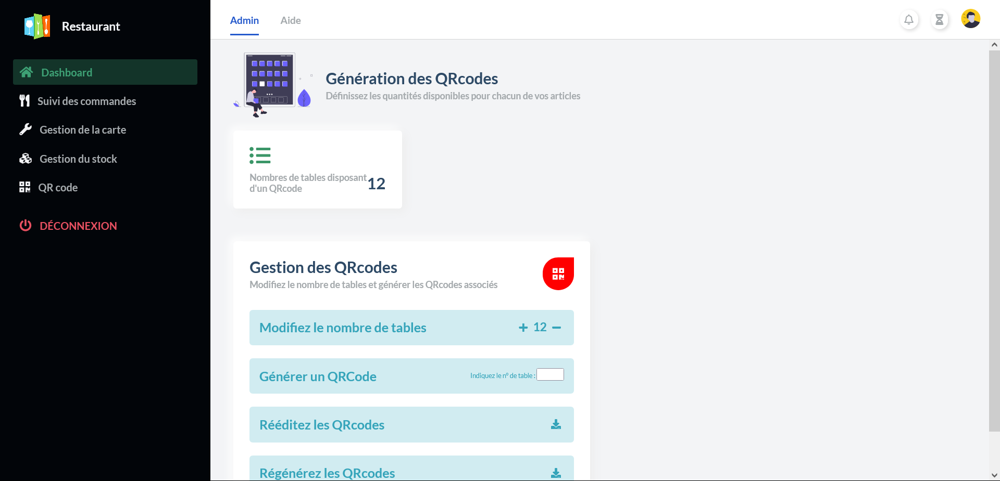

<div id="top"></div>
<!-- PROJECT LOGO -->
<br />
<div align="center">
  <a href="https://gitlab.com/ModernMenu/dashboard">
    
  </a>

  <h3 align="center">Console d'administration du menu digital</h3>

  <p align="center">
    Interface de création de menu et de QRcodes à destination des restaurateurs
    <br />
    <br />
    <a href="https://admin.novation.menu/">Voir la démo</a>

  </p>
</div>


<!-- TABLE OF CONTENTS -->
<details>
  <summary>Table des matières</summary>
  <ol>
    <li>
      <a href="#a-propos-du-projet">A propos du projet</a>
      <ul>
        <li><a href="#créé-avec">Créé avec</a></li>
      </ul>
    </li>
    <li><a href="#usage">Usage</a></li>
    <li><a href="#roadmap">Roadmap</a></li>
    <li><a href="#installation">Installation</a></li>
    <li><a href="#contact">Contact</a></li>
    <li><a href="#crédits">Crédits</a></li>
  </ol>
</details>


<!-- ABOUT THE PROJECT -->
## A propos du projet



Le projet a pour but de fournir aux restaurateurs un outil leur permettant de dématérialiser la carte de leur restaurant.
Il propose une interface d’administration dans laquelle l’utilisateur pourra renseigner le contenu de sa carte : Les différentes catégories telles que les entrées, les plats cuisinés, les boissons, les desserts… ainsi que les différents produits qui composent ces catégories.

Dans un premier temps, les données saisies par l’utilisateur permettront la génération d’un site au format responsive qui sera accessible en scannant un qrcode qui aura été généré également dans l’interface d’administration.

Le client qui aura scanné le QRCode aura la possibilté de passer une commande via le menu.

Dès qu'une commande sera passée, elle sera accessible directement dans l'interface d'administration. Le restaurateur gagne un temps précieux.

<p align="right">(<a href="#top">back to top</a>)</p>


### Créé avec

Cette section liste les technologies utilisées dans le cadre de ce projet

* HTML\CSS
* Javascript
* Python\Flask
* PostgreSQL

<p align="right">(<a href="#top">back to top</a>)</p>


<!-- USAGE EXAMPLES -->
## Usage

Voici un bref descriptif du mode de fonctionnement de ce projet

Fenêtre de connexion, d'inscription et de réinitialisation du mot de passe :


Fenêtre de suivi de commande. On retrouve les commandes passées par le client depuis son téléphone:


Fenêtre de gestion de la carte. Ici, on gère les catégories et les articles, on peut ajouter, modifier, classer, supprimer les articles et catégories:


Fenêtre de gestion du stock. Dans cette fenêtre, on spécifie les quantités disponibles, le produit disparaitra de la carte quand il sera écoulé:


Fenêtre de Génération des QRCodes. Ici, on paramètre le nombre de tables et on génère les QRcodes associés:


<p align="right">(<a href="#top">back to top</a>)</p>


<!-- ROADMAP -->
## Roadmap

- [x] Création de la maquette de l'interface d'administration
- [x] Créer des templates Flask à partir de la maquette
- [x] Choisir une base de données (SQL, noSQL ?)
- [x] Définir la strucure de la BDD
- [ ] Gérer l'authentification
- [ ] ...

<p align="right">(<a href="#top">back to top</a>)</p>

## Installation

Pour installer le projet:

```bash
git clone https://gitlab.com/ModernMenu/dashboard.git
```
On se rend dans le dossier généré et on crée un environnement virtuel:

```python
python -m venv venv
```

On l'active:

```python
.\venv\Scripts\activate
```

On installe les packages nécessaires:

```python
pip install -r .\requirements.txt
```

Le projet fonctionne avec une base de données PostgreSQL, il est nécessaire d'en installer une au préalable:

https://gitlab.com/ModernMenu/tools/postgrespgadminwithpersistentdata

Quand la BDD est démarrée

### Création des tables

Nous avons deux possibiltés:
- Générer des tables vides que nous remplirons à partir du dashboard
- Restaurer un dump qui contient un menu pré-rempli.

#### Création des tables vides

On va créer les tables de notre projet, on va pour cela se connecter dans la console python et on lance les commandes ci-dessous:

```python
(venv) PS C:\Users\Administrateur\Desktop\Projet_fil_rouge\dashboard> python
Python 3.9.0 (tags/v3.9.0:9cf6752, Oct  5 2020, 15:34:40) [MSC v.1927 64 bit (AMD64)] on win32
Type "help", "copyright", "credits" or "license" for more information.
>>> from createdb import db
>>> db.create_all()
>>> exit()
```
On peut événtuellement se connecter sur pgadmin et mettre des données dans les tables

```sql
INSERT INTO public.categorie(
	"nom", visibilite, "position")
	VALUES ('Les entrées', True, 1);
INSERT INTO public.categorie(
	"nom", visibilite, "position")
	VALUES ('Les salades', True, 2);
INSERT INTO public.categorie(
	"nom", visibilite, "position")
	VALUES ('Les viandes et poissons', True, 3);
INSERT INTO public.categorie(
	"nom", visibilite, "position")
	VALUES ('Les hamburgers', True, 4);
```

```sql
INSERT INTO public.article(
	idcategorie, nom, description, prix, visibilite, position)
	VALUES (1, 'Le saucisson sec 150g', 'Le saucisson sec 150g.', 5, True, 1);
INSERT INTO public.article(
	idcategorie, nom, description, prix, visibilite, position)
	VALUES (1, 'Les onions rings', 'Les onions rings.', 7, True, 2);
INSERT INTO public.article(
	idcategorie, nom, description, prix, visibilite, position)
	VALUES (1, 'Trio au fromage', 'Trio au fromage.', 9, True, 3);
INSERT INTO public.article(
	idcategorie, nom, description, prix, visibilite, position)
	VALUES (2, 'La Chèvre chaud', 'Mélange de salade et de mâche assaisonné à la vinaigrette balsamique, pickles de carotte et de chou rouge.', 5, True, 1);
INSERT INTO public.article(
	idcategorie, nom, description, prix, visibilite, position)
	VALUES (2, 'La Caesar au poulet', 'Salade, pickles de carotte et de chou rouge, oignons rouges, aiguillettes de poulet croustillantes.', 7, True, 2);
INSERT INTO public.article(
	idcategorie, nom, description, prix, visibilite, position)
	VALUES (2, 'La Hercule Poirot', 'Mélange de salade et de mâche assaisonné à la vinaigrette balsamique.', 5, True, 3);
INSERT INTO public.article(
	idcategorie, nom, description, prix, visibilite, position)
	VALUES (2, 'La Chef', 'Mélange de salade et de mâche assaisonné.', 7, True, 4);
INSERT INTO public.article(
	idcategorie, nom, description, prix, visibilite, position)
	VALUES (3, 'Onglet', 'Lorem ipsum dolor, sit amet consectetur adipisicing elit.', 10, True, 1);
```
#### Restauration d'un dump avec des données

Se réferer au repository suivant:

https://gitlab.com/ModernMenu/tools/restaurationbdd
## Lancement du programme

Pour lancer le programme:

```bash
python .\app.py 
```
<p align="right">(<a href="#top">back to top</a>)</p>

<!-- CONTACT -->
## Contact

Nagi KARAOUZENE - nagi.karaouzene@outlook.com
Boualem BEKTHAOUI - bbekhtaoui2021@gmail.com
Richard CRUZ - richard.m2iformation@gmail.com

Project Link: [https://gitlab.com/ModernMenu/dashboard](https://gitlab.com/ModernMenu/dashboard)

<p align="right">(<a href="#top">back to top</a>)</p>


<!-- ACKNOWLEDGMENTS -->
## Crédits

* [Photo de connexion (Unsplash)](https://unsplash.com/photos/qW-QuO5b9fY)
* [Responsive Html Css Grid Admin Dashboard (Mustafa Erden)](https://github.com/mustafaerden/Html-Css-Grid-Admin-Dashboard)
* [Illustrations sur les pages de l'interface d'administration (Undraw)](https://undraw.co/)
* [Icones (font awesome)](https://fontawesome.com/)

<p align="right">(<a href="#top">back to top</a>)</p>


